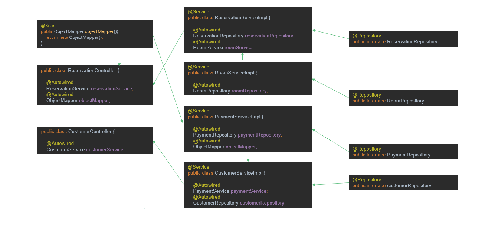

# Spring Boot september 2024

<br/><br/>
<br/><br/>
<br/><br/>
<br/><br/>
#### <a id="top"></a>


* [Java Faker (fake data)](#faker)
* [Swagger (OPENAPI) annotations](#swagger.annotations)
* [Spring Context](#spring.context)
* [@Bean](#bean)
* [@Qualifier](#qualifier)
* [Handige properties](#properties)
* [Curl commando voor een POST request](#post)
* [Autowiring](#autowiring)

<br/><br/>
<br/><br/>
<br/><br/>
<br/><br/>

## Json serialization (annotations in model classes)
* [https://www.baeldung.com/jackson-annotations](https://www.baeldung.com/jackson-annotations)

<br/><br/>
<br/><br/>
<br/><br/>
<br/><br/>

* [Top](#top)
## <a id="faker"></a>Java Faker

Dependency:

```xml
		<dependency>
			<groupId>com.github.javafaker</groupId>
			<artifactId>javafaker</artifactId>
			<version>1.0.2</version>
		</dependency>
```

```java
public class Util {

    private static Faker faker = new Faker();

    public static String getFakeFirstName(){

        return faker.name().firstName();

    }

    public static String getFakeFullName(){

        return faker.name().fullName();

    }
    public static String getFakeAddress(){

        return faker.address().fullAddress();

    }


    public static LocalDateTime getLocalDateTime(){

        DateAndTime dateAndTime = faker.date();

        LocalDateTime localDateTime = dateAndTime
                .birthday()
                .toInstant()
                .atZone(ZoneId.systemDefault())
                .toLocalDateTime();


        return localDateTime;

    }


    public static int getFakeAge() {

        Random r = new Random();
        int low = 18;
        int high = 88;
        int age = r.nextInt(high - low) + low;
        return age;
    }

}
```

* [Top](#top)
## <a id="swagger.annotations"></a>Swagger annotations
* [https://github.com/swagger-api/swagger-core/wiki/Swagger-2.X---Annotations](https://github.com/swagger-api/swagger-core/wiki/Swagger-2.X---Annotations)

<br/><br/>

* @Tag

```java
@RestController
@RequestMapping("/api")
@Tag(name = "API for customer financial transactions",
     description = "This API offers all services needed to handle customer financial transactions")
public class TransactionController {
   ...
}
```

<br/><br/>

* @Operation
* @ApiResponses

```java
@Operation(summary = "Send transaction as JSON and store in database")
@ApiResponses(value = {
    @ApiResponse(responseCode = "200", description = "Message confirming transaction done"),
    @ApiResponse(responseCode = "500", description = "Invalid call", content = @Content),
})
@PutMapping(value = "/transaction/json", consumes = MediaType.APPLICATION_JSON_VALUE, produces = MediaType.APPLICATION_JSON_VALUE)
public ResponseEntity<Message> transactionAsJson(@RequestBody Transaction transaction) {

    logger.info( transaction.toString());
    transactionRepository.save( transaction);
    return new ResponseEntity<>(new Message("Transaction done"), HttpStatus.OK);
    }
```

<br/><br/>

* [Top](#top)
## <a id="spring.context"></a>Spring Context

```java

        ApplicationContext applicationContext = SpringApplication.run(MolvenoLakeResortApplication.class, args);

        // Show what is autowired into ReservationController
        for (String beanDefinitionName : applicationContext.getBeanDefinitionNames()) {
            System.out.println(beanDefinitionName);
            if (beanDefinitionName.startsWith("??????")) {
                Object object = applicationContext.getBean(beanDefinitionName);
                System.out.println("Stop here");
            }
        }
```

* [Top](#top)
## <a id="bean"></a>@Bean
Voorbeeld @Bean annotatie

```java
@Configuration
public class MyConfiguration {

    @Bean(value="sofis1")
    public SofiCheckService1 sofiCheckService1(){
        return new SofiCheckService1();
    }

    @Bean
    public ObjectMapper objectMapper(){
        return new ObjectMapper();
    }
}
```

De ObjectMapper kan je autowiren middels:

```java
    private PrettyObjectMapper objectMapper;

    @Autowired
    public Controller( PrettyObjectMapper objectMapper){
        this.objectMapper = objectMapper;
    }
```

* [Top](#top)
## <a id="qualifier"></a>@Qualifier

Je gebruikt deze annotatie als er bij een interface meer dan één implementatie is.<br>
Spring kan dan zelf geen keuze maken.

```java
@Service
@Qualifier("oracle.datasource")
public class OracleDataSource implements DataSource{

    @Override
    public Iterable<Message> findAll(){
        Message[] messages = { new Message("Oracle is great!!!"), new Message("Oracle is great!!!")};
        return Arrays.asList( messages);
    }
}
```

Bij het autowiren moet je de `@Qualifier` ook gebruiken

```java
    @Autowired
    public OracleController(@Qualifier("oracle.datasource") DataSource dataSource) {
        this.dataSource = dataSource;
    }
```

* [Top](#top)
## <a id="properties"></a>Handige properties

```properties
# Default: 8080
server.port=8081

# Toon sql statements
spring.jpa.show-sql=true
spring.jpa.properties.hibernate.format_sql=true

# Enable console
spring.h2.console.enabled=true
spring.datasource.driverClassName=org.h2.Driver
# Embedded
spring.datasource.url=jdbc:h2:mem:testdb
# Persistent
spring.datasource.url=jdbc:h2:file:C:/Temp/testdb;AUTO_SERVER=TRUE;DB_CLOSE_ON_EXIT=TRUE
spring.datasource.username=sa
spring.datasource.password=sa
# Genereer schema
spring.jpa.hibernate.ddl-auto=none|validate|update|create-drop

```

* [Top](#top)
## <a id="post"></a>Curl commando voor een POST request

```shell
curl -X 'POST' \
'http://localhost:8080/api/message' \
-H 'accept: application/json' \
-H 'Content-Type: application/json' \
-d '{
"id": "3fa85f64-5717-4562-b3fc-2c963f66afa6",
"BERICHT": "Dit is het zoveelste bericht"
}'
```

* [Top](#top)

## <a id="autowiring"></a>Autowiring

Spring inspecteert alle classes in alle packages en zoekt naar Spring annotaties, bijv: <br>
* @RestController
* @Component
* @Service
* @Configuration
* @Repository. <br>

Spring bouwt een boomstructuur van alle singleton objecten van alle gevonden classes (de Application Context). <br>
Spring gebruikt hiervoor 'autowiring'.

[](## "Where did the image go..")

* [Top](#top)
